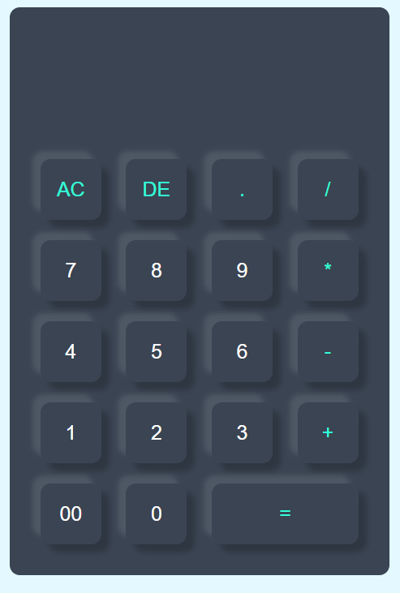

# 🧮 Calculator App

A simple and responsive Calculator built using **HTML, CSS, and JavaScript**. This project performs basic arithmetic operations such as addition, subtraction, multiplication, and division through an interactive user interface.

## 🚀 Live Demo

🔗 https://your-live-demo-link.vercel.app/

## 📸 Screenshot



## ✨ Features

- Basic arithmetic operations (+, -, ×, ÷)
- Clear All (AC) functionality
- Delete last entered character (DE)
- Decimal number support
- Error handling for invalid expressions
- Responsive and clean UI design

## 🛠️ Technologies Used

- HTML5
- CSS3
- JavaScript (Vanilla JS)

## 📂 Project Structure

```text
calculator-app/
│
├── index.html
├── style.css
├── script.js
├── screenshot.png
└── README.md
```

## ⚙️ How It Works

1. Enter numbers and operators using the calculator buttons.
2. The expression is displayed on the screen.
3. Press `=` to calculate the result.
4. Invalid expressions display `Error`.

## 🔧 Installation

```bash
git clone https://github.com/your-username/calculator-app.git

cd calculator-app
```

Open `index.html` in your browser.

## 🎯 Learning Outcomes

Through this project, I learned:

- DOM Manipulation
- Event Handling
- JavaScript Functions
- Error Handling using `try...catch`
- Responsive UI Design
- CSS Flexbox Layout

## 📌 Future Improvements

- Keyboard Support
- Scientific Calculator Functions
- Calculation History
- Dark/Light Mode
- Better Expression Parser instead of `eval()`

## 👨‍💻 Author

**Bhaskar**

BCA Student | Aspiring Full Stack Developer

---

⭐ If you like this project, feel free to give it a star on GitHub.